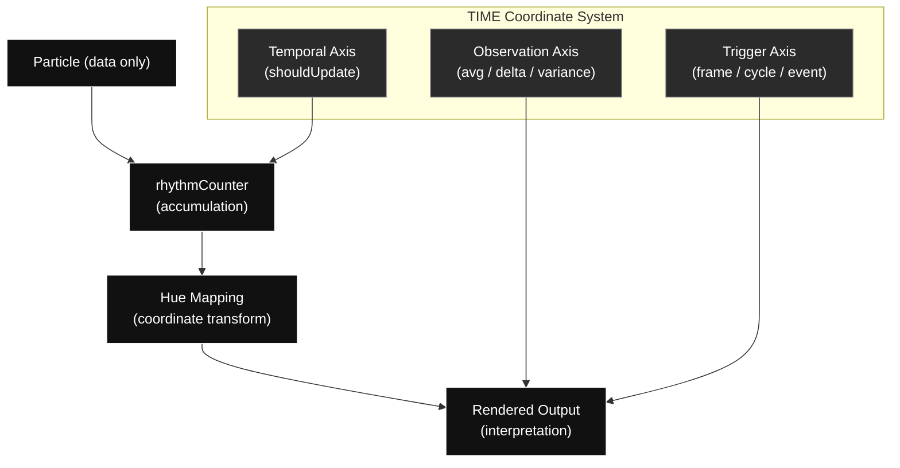

# TIME — A Condition-Based Temporal System

This repository is part of a broader architectural study:

→ *Beyond Patterns: Designing the Boundaries of Code*

While **LOST** focuses on the removal of ownership (refactoring, decoupling, separation of concerns),  
**TIME** explores how a system can operate without owning time.

The system does not simulate time.  
It distributes temporal properties across data and interprets them per frame.

Together, LOST and TIME form a dual structure:

- **LOST** → removal of ownership  
- **TIME** → distribution of condition  

---

## Origin

This algorithm originates from the work *time* (2007), first presented as **MODE A (Native Natural Time)** in the exhibition *Horizon Without Boundaries*.

It represents an early exploration of how discrete accumulation transitions into continuous temporal perception.

This repository reconstructs and extends that idea into a formal system.

---

## Concept

This is not a visual effect template.

It is a structural experiment in:

- data ownership  
- temporal distribution  
- engine boundaries  

The system operates under the following principles:

- Time is not owned by objects  
- Input does not create time  
- The loop defines temporal existence  
- The system performs interpretation, not instruction  

> Microphone input does not generate time.  
> It is only sampled within it.

---

## Core Principles

- No module owns time except the frame loop  
- State is replaced by framed conditions and recorded history  
- Color is not decoration — it is a computational coordinate  
- External input acts as a coefficient, not a trigger  


## Architecture



This diagram does not represent a signal flow.

It describes a coordinate system in which temporal behavior emerges through interpretation.

The particle does not contain time.

Instead, time is distributed across independent axes, and the system evaluates conditions per frame to produce output.

---

## Architecture

[External Input k]
↓
[Temporal Sampling] ← stride
↓
[State Update] ← dynamicStep
↓
[History Accumulation]
↓
[Temporal Compression] (distance-based)
↓
[Rendering]


External input **k** does not directly drive state transitions.

Instead, it modulates how time is:

- accumulated  
- sampled  
- compressed  
- interpreted  

Time is not a parameter.  
It is an emergent structure.

---

## What This Framework Demonstrates

- Frame-owned time architecture  
- Condition-based interpretation (no state branching)  
- Particle history as framed state (not a state machine)  
- Object pooling with structural reset  
- Replaceable rendering layer (Bitmap / GPU-ready)  

---

## Folder Structure

src/
├── app/Main.js
├── assets/
├── color/
├── library/
├── pool/
├── particle/
├── render/
├── sound/
├── system/
└── EngineStage.js

index.html


All modules are designed to be replaceable.  
The system maintains structure through boundaries, not dependencies.

---

## Quick Start

```bash
npx serve .
```
or

```bash
npm install
npm run dev
```
Open in a modern browser (ES Modules required).

## Relation to LOST

This repository is conceptually paired with:

→ LOST — Structural Refactoring and De-ownership System

LOST removes ownership.
TIME redistributes it.

Together, they form a unified architectural model.

## Author

Jungae Lee
Korea National University of Arts
jungae1000@karts.ac.kr
